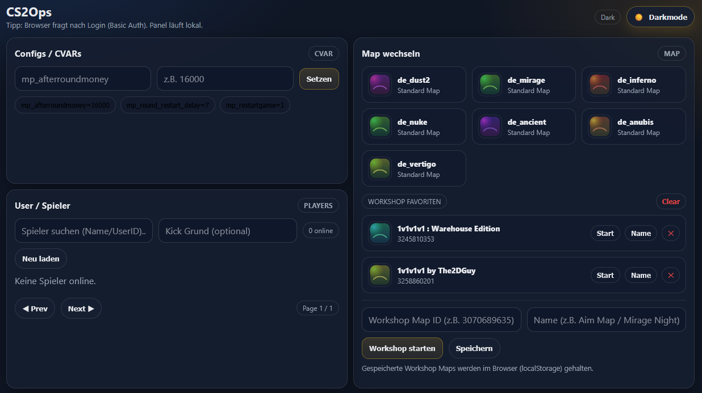
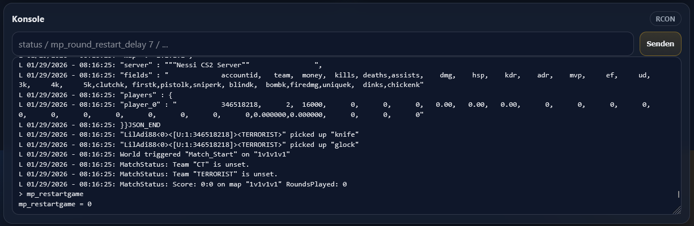
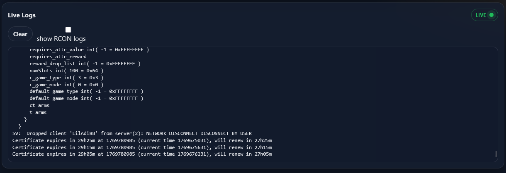

# CS2Ops

CS2Ops is a lightweight web control panel for managing a Counter-Strike 2 dedicated server via **RCON**.
It provides a modern UI for common admin tasks (maps, CVARs, players) and includes **live log streaming** — including automatic **SteamID64 detection** when players join.

This project is designed to run close to the CS2 server (ideally on the same host), especially when CS2 is running inside Docker.

> [!WARNING]  
> This project is still in heavy development.  
> The current release is an early first version and may contain bugs or breaking changes.

---

## What is CS2Ops?

CS2Ops is an Express + vanilla JavaScript web app that allows you to:

- Access a browser-based admin UI (Basic Auth protected)
- Send commands to your CS2 server via RCON
- Stream `docker logs` from the CS2 container directly into the browser (SSE)
- Extract SteamID64 automatically from join validation log lines
- Manage maps, workshop maps, CVARs, and players from a clean dashboard

---

## Features

### ✅ RCON Console
- Send any RCON command
- View output instantly in the panel
- Autocomplete for commands and CVARs (cached)

---

### ✅ CVAR Management
- Set CVARs quickly via UI
- Preset “pill buttons” for common server configs

---

### ✅ Map Control
- One-click standard map switching
- Start Workshop maps by ID (`host_workshop_map`)
- Save Workshop favorites (stored in browser localStorage)

---

### ✅ Player Management
- Auto-refresh live player list
- Search by name/userid/steam64
- Kick players with optional reason
- SteamID64 displayed automatically once detected from logs

---

### ✅ Live Logs
- Real-time log streaming in the web UI (Server-Sent Events)
- Smart filtering to hide noisy RCON spam (optional toggle)
- Status badge: **LIVE / RECONNECTING / OFFLINE**
- Automatic reconnect handling for Firefox/Chrome stability

---

### ✅ Security
- Panel protected via **Basic Auth**
- Rate limiting enabled
- Helmet security headers included

---

## Prerequisites

You need:

- A Linux host (recommended)
- **Node.js + npm**
- A working **CS2 Dedicated Server** with RCON enabled
- CS2 Dedicated Server can run locally in Docker, or remotely if HTTP remote logs are enabled

Recommended CS2 Docker project:

- https://github.com/joedwards32/CS2

⚠️ CS2Ops streams logs with:

```bash
docker logs -f <container>
```
Original Docker log mode expects CS2 to run on the same Docker host. For VPS panel + LAN CS2 server deployments, use HTTP remote logs with `LOG_SOURCE=http`.

CS2Ops supports:

```env
LOG_SOURCE=docker  # docker logs -f, original local Docker mode
LOG_SOURCE=http    # CS2 logaddress_add_http remote receiver
LOG_SOURCE=none    # disable live logs, keep RCON features
```

See [docs/remote-http-log.md](docs/remote-http-log.md) for the HTTP remote log setup.

## Installation

### 1. Install Node.js + npm

Debian/Ubuntu example:

```bash
sudo apt update
sudo apt install -y nodejs npm
```
If your distro ships an old Node version, use NodeSource for a newer LTS.

### 2. Clone the repository

```bash
cd /opt
sudo git clone https://github.com/<yourname>/cs2ops.git
cd cs2ops
```

### 3. Install dependencies

```bash
sudo npm install
```

### 4. Configure environment
Create a .env file:

```bash
nano /opt/cs2ops/.env
```

Example configuration:
```
# Panel
PANEL_PORT=8080
PANEL_USER=admin
PANEL_PASS=change_me

# CS2 RCON Target
CS2_HOST=127.0.0.1
CS2_PORT=27015
CS2_RCON_PASSWORD=your_rcon_password

# Docker container name (CS2 server container)
DOCKER_CONTAINER=cs2-dedicated

# How many log lines to show on connect
LOG_LINES=200

5. Start CS2Ops manually

```bash
npm start
```

You should see:
```
CS2 RCON Panel listening on http://127.0.0.1:8080
```

Now open:
```
http://<your-server-ip>:8080
```

Login with your Basic Auth credentials.

### Running as a systemd service (recommended)

#### 1. Create service file
```bash
sudo nano /etc/systemd/system/cs2ops.service
```

Paste:
```bash
[Unit]
Description=CS2Ops Web RCON Panel
After=network.target docker.service
Requires=docker.service

[Service]
Type=simple
WorkingDirectory=/opt/cs2ops
ExecStart=/usr/bin/npm start
Restart=always
RestartSec=3
EnvironmentFile=/opt/cs2ops/.env
User=root

[Install]
WantedBy=multi-user.target
```
#### 2. Enable + start service
```bash
sudo systemctl daemon-reload
sudo systemctl enable cs2ops
sudo systemctl start cs2ops
```

#### 3. Check status
```bash
sudo systemctl status cs2ops
```

#### 4. View logs
```bash
journalctl -u cs2ops -f
```
---

## Apache Reverse Proxy Setup (Port 80)

CS2Ops runs by default on a local Node.js port (e.g. `8080`).  
To make it reachable via a normal webserver URL, you can put **Apache2** in front of it using a Reverse Proxy.


### 1. Install Apache2

On Ubuntu/Debian:

```bash
sudo apt update
sudo apt install apache2 -y
```

Enable Apache at boot:
```bash
sudo systemctl enable apache2
sudo systemctl start apache2
```

Check if Apache is running:
```bash
systemctl status apache2
```

Now open in browser:
```bash
http://YOUR_SERVER_IP/
```

### 2. Enable Required Proxy Modules

Apache needs proxy modules enabled:
```bash
sudo a2enmod proxy
sudo a2enmod proxy_http
sudo a2enmod headers
sudo a2enmod rewrite
```

Reload Apache:
```bash
sudo systemctl restart apache2
```

### 3. Configure Reverse Proxy for CS2Ops

Create a new Apache VirtualHost:
```bash
sudo nano /etc/apache2/sites-available/cs2ops.conf
```

Example configuration:
```bash
<VirtualHost *:80>
    ServerName cs2ops.local

    ProxyPreserveHost On

    ProxyPass / http://127.0.0.1:8080/
    ProxyPassReverse / http://127.0.0.1:8080/

    ErrorLog ${APACHE_LOG_DIR}/cs2ops_error.log
    CustomLog ${APACHE_LOG_DIR}/cs2ops_access.log combined
</VirtualHost>
```
Replace 8080 if your panel runs on another port.

### 4. Enable the Site
```bash
sudo a2ensite cs2ops.conf
sudo a2dissite 000-default.conf
```

Reload Apache:
```bash
sudo systemctl reload apache2
```

### 5. Open Firewall (if needed)
```bash
sudo ufw allow 80/tcp
sudo ufw reload
```

## ✅ Result

Now CS2Ops is accessible via:
```
http://YOUR_SERVER_IP/
```

Apache forwards all traffic internally to:
```
http://127.0.0.1:8080/
```

---
## Screenshots

### CVAR - PLAYERS - MAPS


### CONSOLE


### Live Log Stream


---

## Notes
- SteamID64 is extracted automatically from lines like:
```
"Player<65280><[U:1:141511211]><>" STEAM USERID validated
```
- Workshop favorites are stored locally in your browser (no database needed).
- Log streaming requires Docker access and correct container name.

## Roadmap / Ideas
- Steam profile avatar display
- Ban management
- Server config presets
- Multi-server support

## License
MIT License — use it freely, modify it, improve it.
